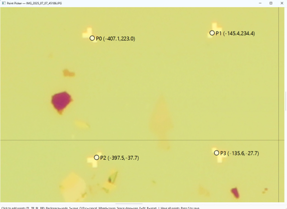

# Point Align - User Manual
**Version 1.1**

---

## QUICK START - 5 Steps to Align Images

### Step 1: Add Your Images
- Click **"Add images..."** button
- Select your microscope images (JPG, PNG, TIF, etc.)

### Step 2: Set Output Location
- Click **"Browse Folder..."**
- Choose where to save your aligned .lys file

### Step 3: Click "Run Alignment"
- Click the green **"Run Alignment"** button
- Point Picker window opens

### Step 4: Click the 4 Alignment Points
**Click in this exact order on your image:**

```
Point Order:
1. Top-Left intersection
2. Top-Right intersection
3. Bottom-Left intersection
4. Bottom-Right intersection
```

**What to click:** The 4 intersections where the **innermost L-shapes meet the box corners**



The diagram shows the 4 alignment points (white crosshairs) where the L-shaped alignment marks meet the corner boxes. Click in order: Top-Left, Top-Right, Bottom-Left, Bottom-Right.

### Step 5: View in KLayout
- Double-click the output `.lys` file to open it in KLayout

---

## Understanding Output Files

### .lys Files
- KLayout session file (XML format)
- Contains:
  - Image file paths
  - Transformation matrices
  - GDS layout reference
  - KLayout view settings (zoom, layers, etc.)
- Opens directly in KLayout (double-click)

### File Locations
**Default output:** Desktop folder named `Aligned-YYYY-MM-DD-#.lys`

---

## Troubleshooting

### Images Don't Appear in KLayout

**Issue:** Opened .lys in KLayout, but no images visible

**Solutions:**
- Check image file paths are correct
- Verify images weren't moved/deleted after alignment

### Poor Alignment (High RMS Error)

**Causes:**
- Clicked wrong points
- Used wrong point order

---

## How LYS Works

### Coordinate Systems

**Image Space:** Pixels (top-left origin)

**GDS Space:** Micrometers (center origin)

**Transformation:** Image pixels → GDS micrometers via calculated matrix

### File Format

.lys files are XML-based with structure:
- `<layout-view>`: GDS layout reference
- `<images>`: List of image annotations
- Each image contains path and transformation matrix

---

### Custom Coordinate Entry
Enter coordinates manually instead of using (-50,60),(70,60),(-50,-60),(70,-60)

Format: `(X1,Y1),(X2,Y2),(X3,Y3),(X4,Y4)` in micrometers

---

*End of User Manual*
